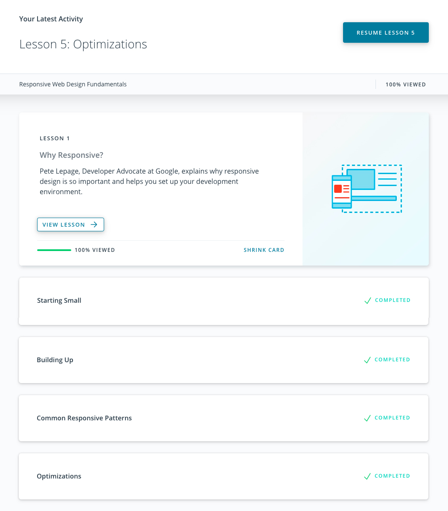

# kottans-frontend
## :octocat: My progress 
### General
- [x] [Git Basics](https://github.com/kottans/frontend/blob/master/tasks/git-intro.md) 
- [x] [Linux CLI and Networking](https://github.com/kottans/frontend/blob/master/tasks/linux-cli-http.md) 
- [x] [VCS (hello gitty), GitHub and Collaboration](https://github.com/kottans/frontend/blob/master/tasks/git-collaboration.md)
### Front-End Basics
- [x] [Intro to HTML & CSS](https://github.com/kottans/frontend/blob/master/tasks/html-css-intro.md) 
- [x] [Responsive Web Design](https://github.com/kottans/frontend/blob/master/tasks/html-css-responsive.md) 
- [x] [HTML & CSS Practice](https://github.com/kottans/frontend/blob/master/tasks/html-css-popup.md) 
- [ ] [JavaScript Basics](https://github.com/kottans/frontend/blob/master/tasks/js-basics.md) 
- [ ] [Document Object Model](https://github.com/kottans/frontend/blob/master/tasks/js-dom.md) – practice
### Advanced Topics
- [ ] [Building a Tiny JS World (pre-OOP)](https://github.com/kottans/frontend/blob/master/tasks/js-pre-oop.md) – practice 
- [ ] [Object oriented JS](https://github.com/kottans/frontend/blob/master/tasks/js-oop.md) – practice 
- [ ] [OOP exercise](https://github.com/kottans/frontend/blob/master/tasks/js-post-oop.md) – practice 
- [ ] [Offline Web Applications](https://github.com/kottans/frontend/blob/master/tasks/app-design-offline.md) 
- [ ] [Memory pair game](https://github.com/kottans/frontend/blob/master/tasks/memory-pair-game.md) – real project! 
- [ ] [Website Performance Optimization](https://github.com/kottans/frontend/blob/master/tasks/app-design-performance.md) 
- [ ] [Friends App](https://github.com/kottans/frontend/blob/master/tasks/friends-app.md) – real project! 

## Git Basics
### Version Control with Git (Udacity)

Version Control with Git

### learngitbranching.js.org

Main

Remote

#### I already passed these tasks, so it was not difficult for me, but i like to refresh my knowledge.

## Linux CLI, and HTTP
### Linux Survival (4 modules)

Quiz Number 1

Quiz Number 2

Quiz Number 3

Quiz Number 4

#### I already passed these modules in the past, so nothing was new for me, but I enjoyed do that again.

## Git Collaboration

GitHub & Collaboration

There was nothing new for me in this section, i just went through it again.

## Intro to HTML and CSS

I didn't use CSS Grid before and all information about Gird was new for me, but I'm sure that will use that in future.

## Responsive Web Design

Responsive Web Design Fundamentals

Flexbox Froggy

Responsive patterns was new for me.
"Column drop", "mostly fluid", "layout shifter" and "off canvas".

## HTML & CSS practice

[Hooli-style Popup](https://natashafir.github.io/hooli-style-popup/)

## JS Basics

Intro to JS

