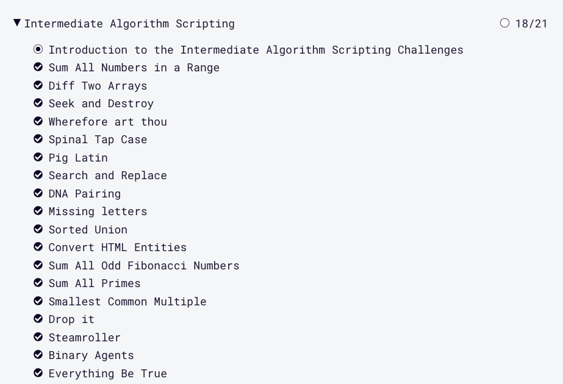

# kottans-frontend
## :octocat: My progress 
### General
- [x] [Git Basics](https://github.com/kottans/frontend/blob/master/tasks/git-intro.md) 
- [x] [Linux CLI and Networking](https://github.com/kottans/frontend/blob/master/tasks/linux-cli-http.md) 
- [x] [VCS (hello gitty), GitHub and Collaboration](https://github.com/kottans/frontend/blob/master/tasks/git-collaboration.md)
### Front-End Basics
- [x] [Intro to HTML & CSS](https://github.com/kottans/frontend/blob/master/tasks/html-css-intro.md) 
- [x] [Responsive Web Design](https://github.com/kottans/frontend/blob/master/tasks/html-css-responsive.md) 
- [x] [HTML & CSS Practice](https://github.com/kottans/frontend/blob/master/tasks/html-css-popup.md) 
- [x] [JavaScript Basics](https://github.com/kottans/frontend/blob/master/tasks/js-basics.md) 
- [x] [Document Object Model](https://github.com/kottans/frontend/blob/master/tasks/js-dom.md) – practice
### Advanced Topics
- [x] [Building a Tiny JS World (pre-OOP)](https://github.com/kottans/frontend/blob/master/tasks/js-pre-oop.md) – practice 
- [x] [Object oriented JS](https://github.com/kottans/frontend/blob/master/tasks/js-oop.md) – practice 
- [ ] [OOP exercise](https://github.com/kottans/frontend/blob/master/tasks/js-post-oop.md) – practice 
- [ ] [Offline Web Applications](https://github.com/kottans/frontend/blob/master/tasks/app-design-offline.md) 
- [ ] [Memory pair game](https://github.com/kottans/frontend/blob/master/tasks/memory-pair-game.md) – real project! 
- [ ] [Website Performance Optimization](https://github.com/kottans/frontend/blob/master/tasks/app-design-performance.md) 
- [ ] [Friends App](https://github.com/kottans/frontend/blob/master/tasks/friends-app.md) – real project! 

## Git Basics
### Version Control with Git (Udacity)

Version Control with Git

### learngitbranching.js.org

Main

Remote

#### I already passed these tasks, so it was not difficult for me, but i like to refresh my knowledge.

## Linux CLI, and HTTP
### Linux Survival (4 modules)

Quiz Number 1

Quiz Number 2

Quiz Number 3

Quiz Number 4

#### I already passed these modules in the past, so nothing was new for me, but I enjoyed do that again.

## Git Collaboration

GitHub & Collaboration

There was nothing new for me in this section, i just went through it again.

## Intro to HTML and CSS

Intro to HTML & CSS

Learn HTML

Learn CSS

I didn't use CSS Grid before and all information about Gird was new for me, but I'm sure that will use that in future.

## Responsive Web Design

Responsive Web Design Fundamentals

Flexbox Froggy

Responsive patterns was new for me.
"Column drop", "mostly fluid", "layout shifter" and "off canvas".

## HTML & CSS practice

[Popup](https://natashafir.github.io/hooli-style-popup/)

## JS Basics

Intro to JS

FreeCodeCamp exercises

- In functional programming, changing or altering things is called <em>mutation</em>, and the outcome is called a <em>side effect</em>. A function, ideally, should be a <em>pure function</em>, meaning that it does not cause any side effects.
- Functions are considered <em>first class objects</em> in JavaScript, which means they can be used like any other object. They can be saved in variables, stored in an object, or passed as function arguments.
- The `map` method iterates over each item in an array and returns a new array containing the results of calling the callback function on each element. It does this without mutating the original array.
  When the callback is used, it is passed three arguments. The first argument is the current element being processed. The second is the index of that element and the third is the array upon which the map method was called.
- `filter` calls a function on each element of an array and returns a new array containing only the elements for which that function returns true. In other words, it filters the array, based on the function passed to it.
  The callback function accepts three arguments. The first argument is the current element being processed. The second is the index of that element and the third is the array upon which the `filter` method was called.
- The `slice` method returns a copy of certain elements of an array. It can take two arguments, the first gives the index of where to begin the slice, the second is the index for where to end the slice (and it's non-inclusive). If the arguments are not provided, the default is to start at the beginning of the array through the end, which is an easy way to make a copy of the entire array. The `slice` method does not mutate the original array, but returns a new one.
- `splice` takes arguments for the index of where to start removing items, then the number of items to remove. If the second argument is not provided, the default is to remove items through the end. However, the `splice` method mutates the original array it is called on.
- <em>Concatenation</em> means to join items end to end. JavaScript offers the `concat` method for both strings and arrays that work in the same way. For arrays, the method is called on one, then another array is provided as the argument to `concat`, which is added to the end of the first array. It returns a new array and does not mutate either of the original arrays.
- The `reduce` method iterates over each item in an array and returns a single value (i.e. string, number, object, array). This is achieved via a callback function that is called on each iteration.
  The callback function accepts four arguments. The first argument is known as the accumulator, which gets assigned the return value of the callback function from the previous iteration, the second is the current element being processed, the third is the index of that element and the fourth is the array upon which `reduce` is called.
  In addition to the callback function, `reduce` has an additional parameter which takes an initial value for the accumulator. If this second parameter is not used, then the first iteration is skipped and the second iteration gets passed the first element of the array as the accumulator.
 
## DOM

JavaScript and the DOM

freecodecamp Algorithm Scripting Challenges

Click [here](https://natashafir.github.io/interactive-side-menu) to see some wonderful Mexican places.

## A Tiny JS World

Click [here](https://natashafir.github.io/a-tiny-JS-world/) to see a Tiny JS World.

## Object Oriented JS

[codewars](https://www.codewars.com/users/natashafir)

Rank: 6 kyu

Object Oriented JS

[Frogger-game Code](https://github.com/natashafir/frogger-game/blob/main/js/app.js)
[Frogger-game Demo](https://natashafir.github.io/frogger-game/)

##OOP exercise